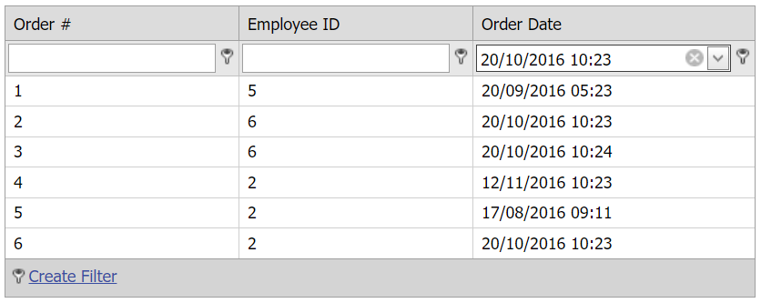

#Grid View for ASP.NET Web Forms - How to filter a date column by both date and time
<!-- run online -->
**[[Run Online]](https://codecentral.devexpress.com/t446517/)**
<!-- run online end -->

This example demonstrates how to create a custom filter criterion to filter a date column by both date and time values.



## Overview

Follow the steps below to filter a date column:

1. Create the [Grid View](https://docs.devexpress.com/AspNet/DevExpress.Web.ASPxGridView) control, bind it to a data source, add a date column, and set the grid's [ShowFilterRow](https://docs.devexpress.com/AspNet/DevExpress.Web.ASPxGridViewSettings.ShowFilterRow) property to `true`.

    ```aspx
    <dx:ASPxGridView ID="ASPxGridView1" runat="server" AutoGenerateColumns="False"
        OnAutoFilterCellEditorInitialize="ASPxGridView1_AutoFilterCellEditorInitialize"
        OnProcessColumnAutoFilter="ASPxGridView1_ProcessColumnAutoFilter" >
        <Settings ShowFilterBar="Visible" ShowFilterRow="true" ShowFilterRowMenu="true" />
        <Columns>
            <!-- ... -->
            <dx:GridViewDataDateColumn FieldName="OrderDate" VisibleIndex="3" Settings-FilterMode="Value" >
                <PropertiesDateEdit DisplayFormatString="dd/MM/yyyy HH:mm" EditFormatString="dd/MM/yyyy HH:mm" />
            </dx:GridViewDataDateColumn>
        </Columns>
    </dx:ASPxGridView>
    ```

2. Handle the grid's server-side [ProcessColumnAutoFilter](https://docs.devexpress.com/AspNet/DevExpress.Web.ASPxGridView.ProcessColumnAutoFilter) event. In the handler, create a custom group operator and assign it to the [Criteria](https://docs.devexpress.com/AspNet/DevExpress.Web.GridAutoFilterEventArgs.Criteria) argument property.

    ```csharp
    string displayText = String.Empty;
    DateTime curDate;
    protected void ASPxGridView1_ProcessColumnAutoFilter(object sender, DevExpress.Web.ASPxGridViewAutoFilterEventArgs e) {
        if (e.Column.FieldName != "OrderDate")
            return;

        if (e.Kind == DevExpress.Web.GridViewAutoFilterEventKind.CreateCriteria)
            if (DateTime.TryParse(e.Value, CultureInfo.InvariantCulture, DateTimeStyles.None, out curDate)) {
                BinaryOperator op1 = new BinaryOperator("OrderDate", curDate, BinaryOperatorType.GreaterOrEqual);
                BinaryOperator op2 = new BinaryOperator("OrderDate", curDate.AddMinutes(1), BinaryOperatorType.Less);
                GroupOperator grOp = new GroupOperator(GroupOperatorType.And, op1, op2);
                e.Criteria = grOp;
                displayText = curDate.ToString("dd-MMMM-yyyy hh:mm");
            }

        if (e.Kind == DevExpress.Web.GridViewAutoFilterEventKind.ExtractDisplayText)
            e.Value = displayText;
    }
    ```


3. To display a date edit control in a filter row cell, handle the grid's server-side [AutoFilterCellEditorInitialize](https://docs.devexpress.com/AspNet/DevExpress.Web.ASPxGridView.AutoFilterCellEditorInitialize) event. In the handler, specify the visibility of the editor's time section. 

    ```csharp
    protected void ASPxGridView1_AutoFilterCellEditorInitialize(object sender, DevExpress.Web.ASPxGridViewEditorEventArgs e) {
        if (e.Column.FieldName != "OrderDate")
            return;
        ASPxDateEdit editor = e.Editor as ASPxDateEdit;
        editor.TimeSectionProperties.Visible=true;
        editor.TimeSectionProperties.TimeEditProperties.EditFormatString="hh:mm";
    }
    ```

## Files to Review

* [Default.aspx](./CS/Default.aspx) (VB: [Default.aspx](./VB/Default.aspx))
* [Default.aspx.cs](./CS/Default.aspx.cs) (VB: [Default.aspx.vb](./VB/Default.aspx.vb))

## Documentation

* [Filter Data in Grid](https://docs.devexpress.com/AspNet/3716/components/grid-view/concepts/filter-data)
